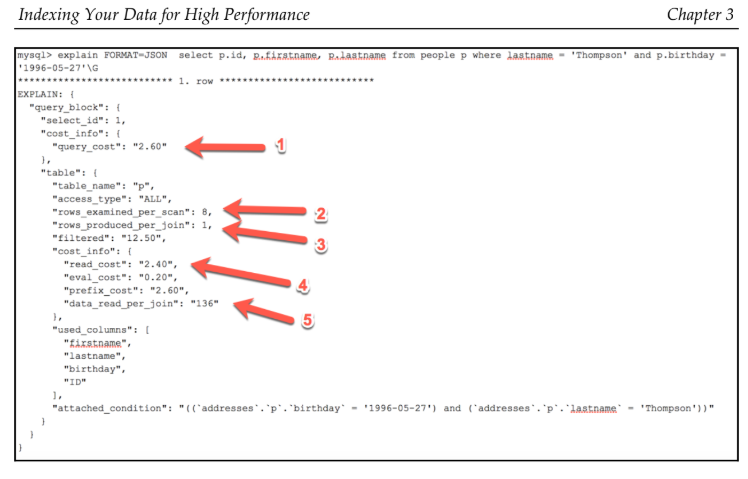

```sql
 explain format=json select id, user_id, event_name, time from events\g
```
# **Học được từ Case Study**

---

## **1. Hiểu EXPLAIN JSON**
- Các chỉ số như:
  - **`Query_cost`**: Đánh giá chi phí thực thi truy vấn.
  - **`rows_examined_per_scan`**: Số bản ghi được quét trong mỗi lần quét bảng.
  - **`data_read_per_join`**: Số lượng bản ghi được đọc trong các phép **JOIN**.
- Giúp đánh giá hiệu suất và xác định các điểm cần tối ưu hóa trong truy vấn.

---

## **2. Lợi ích của định dạng JSON**
- Định dạng JSON trong **MySQL 8.0** cung cấp thêm nhiều thông tin chi tiết hơn so với định dạng TRADITIONAL.
- Hỗ trợ các nhà phát triển hiểu sâu hơn về cách MySQL xử lý truy vấn và tối ưu hóa.

---

## **3. Tầm quan trọng của chỉ mục**
- Với các bảng lớn:
  - Thiếu chỉ mục có thể làm tăng **`Query_cost`** và **`rows_examined_per_scan`**, dẫn đến hiệu suất kém.
  - Chỉ mục giúp giảm số bản ghi phải quét, cải thiện tốc độ thực thi truy vấn.

---

> Việc sử dụng EXPLAIN JSON trong MySQL là một công cụ mạnh mẽ để phân tích và tối ưu hóa hiệu suất truy vấn, đặc biệt khi làm việc với các bảng lớn và phức tạp.


# **Phân tích các thông số từ EXPLAIN JSON trong MySQL**

---

## **1. Query_cost (Cost_info)**
- **Ý nghĩa**:
  - Chi phí mà MySQL optimizer phải bỏ ra để thực thi truy vấn, được đo bằng "đơn vị" (**units**).
- **Ví dụ**:
  - Với bảng có **1 triệu bản ghi** mà không có chỉ mục, chi phí có thể lớn hơn **50 units**.
  - Trong ví dụ, chi phí **2.60 units** cho thấy quá trình **quét toàn bộ bảng (FULL SCAN)** chỉ thực hiện trên **6 bản ghi**, vì vậy rất nhanh.

---

## **2. rows_examined_per_scan**
- **Ý nghĩa**:
  - Số bản ghi được quét trong bảng.
- **Ví dụ**:
  - Trong ví dụ, giá trị là **8**, tức là **8 bản ghi đã được duyệt qua** trong một lần quét.

---

## **3. rows_produced_per_join**
- **Ý nghĩa**:
  - Số bản ghi được xử lý từ một phép **JOIN**.
- **Đề xuất**:
  - Giá trị này nên nhỏ để đảm bảo truy vấn được thực thi nhanh chóng.

---

## **4. read_cost**
- **Ý nghĩa**:
  - Chi phí mà MySQL optimizer phải bỏ ra để đọc dữ liệu.
- **Ví dụ**:
  - Giá trị **2.40** cho biết dữ liệu được đọc rất nhanh, vì chi phí thấp.

---

## **5. data_read_per_join**
- **Ý nghĩa**:
  - Số lượng bản ghi đã được đọc hoặc thấy trong một phép **JOIN**.
- **Đề xuất**:
  - Số lượng càng nhỏ càng tốt. Nếu giá trị này lớn, bạn cần xem lại cách thiết kế **JOIN** hoặc tối ưu hóa chỉ mục.

---

> **Kết luận**: Các thông số từ **EXPLAIN JSON** cung cấp những chỉ số quan trọng để đánh giá và tối ưu hóa hiệu suất của truy vấn MySQL. Chúng giúp bạn xác định các vấn đề tiềm năng trong việc quét bảng hoặc xử lý JOIN và cải thiện hiệu quả.
