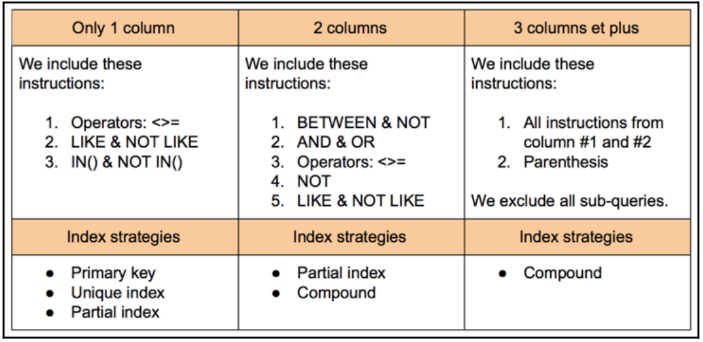

# **Tổ chức các cột trong chỉ mục để tối ưu hóa truy vấn**

---

## **Mục tiêu**
Trong phần này, bạn sẽ học cách tổ chức các cột trong chỉ mục để tối ưu hóa hiệu suất truy vấn.

---

## **Hướng dẫn tổ chức cột trong chỉ mục**
Để đạt hiệu quả cao nhất, việc tổ chức các cột trong chỉ mục phải dựa trên các mệnh đề như:
- **WHERE**
- **GROUP BY**
- **ORDER BY**

Việc tổ chức đúng thứ tự và cấu trúc chỉ mục có thể giúp MySQL xử lý truy vấn nhanh hơn và sử dụng tài nguyên hiệu quả hơn.

---

## **Biểu đồ minh họa**
Bảng dưới đây sẽ mô tả yêu cầu về chỉ mục dựa trên số lượng cột được sử dụng trong các mệnh đề:

| **Số lượng cột trong truy vấn** | **Chỉ mục cần thiết**               |
|----------------------------------|-------------------------------------|
| 1 cột                           | Chỉ mục đơn cột (Single Column Index) |
| 2 cột                           | Chỉ mục nhiều cột (Compound Index) theo thứ tự **cột 1, cột 2** |
| 3+ cột                          | Chỉ mục nhiều cột, với thứ tự **MostSelective → LessSelective** |

---

## **Lưu ý quan trọng**
1. **Thứ tự các cột trong chỉ mục là rất quan trọng**:
   - Chỉ mục nhiều cột chỉ hiệu quả nếu tuân thủ thứ tự từ trái sang phải như trong định nghĩa chỉ mục.
   - Bỏ qua bất kỳ cột nào ở giữa sẽ khiến MySQL không sử dụng được chỉ mục.

2. **Kết hợp nhiều mệnh đề trong truy vấn**:
   - Ví dụ, nếu truy vấn của bạn sử dụng cả `WHERE`, `GROUP BY`, và `ORDER BY`, chỉ mục cần phải bao gồm tất cả các cột liên quan.

---

### Kết luận
- 1 cột: Sử dụng chỉ mục đơn giản, như khóa chính hoặc chỉ mục duy nhất.
- 2 cột: Sử dụng chỉ mục Compound với các điều kiện như BETWEEN, AND, OR.
- 3 cột trở lên: Chỉ mục Compound hiệu quả hơn, nhưng cần chú ý loại bỏ truy vấn phụ để tránh làm chậm hiệu suất.
