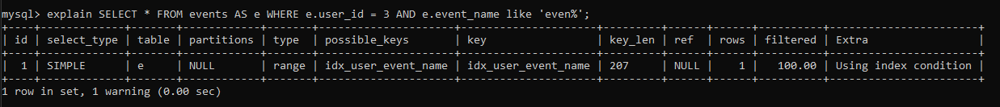
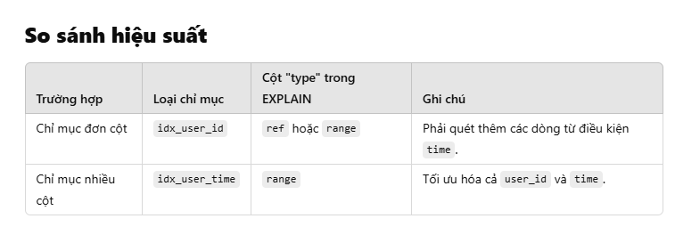

# **Tình huống thực tế: Sử dụng chỉ mục nhiều cột**

---

## **Tình huống: Hệ thống quản lý nhân viên**
Bạn có một bảng tên là `employees` để lưu thông tin nhân viên, và bạn thường thực hiện các truy vấn dựa trên **phòng ban (department_id)** và **ngày gia nhập (hire_date)**.

---

## **Cấu trúc bảng**
```sql
CREATE TABLE employees (
    id INT PRIMARY KEY AUTO_INCREMENT,
    name VARCHAR(50),
    department_id INT,
    hire_date DATE,
    salary DECIMAL(10, 2)
);
```
## Truy vấn thường xuyên

Bạn thường cần tìm nhân viên thuộc một phòng ban cụ thể và gia nhập trong một khoảng thời gian:
```sql
SELECT * 
FROM employees 
WHERE department_id = 3 
  AND hire_date BETWEEN '2023-01-01' AND '2023-12-31';
  ```

## Vấn đề khi sử dụng chỉ mục đơn cột

Nếu bạn tạo chỉ mục đơn cột trên department_id và hire_date riêng lẻ

```sql
CREATE INDEX idx_department_id ON employees(department_id);
CREATE INDEX idx_hire_date ON employees(hire_date);
  ```
#### Hệ quả:
- MySQL phải quyết định chỉ sử dụng một trong hai chỉ mục (dựa trên thuật toán của bộ tối ưu hóa).
- Nếu MySQL chọn sai chỉ mục hoặc không thể tối ưu hóa, hệ thống sẽ quét toàn bộ bảng (full table scan).
- Điều này dẫn đến hiệu suất kém với bảng có hàng triệu bản ghi.

## **Giải pháp: Chỉ mục nhiều cột**

Thay vì sử dụng hai chỉ mục riêng lẻ, hãy tạo một **chỉ mục nhiều cột** để tối ưu hóa hiệu suất truy vấn:

```sql
CREATE INDEX idx_department_hire ON employees(department_id, hire_date);
  ```
### Lợi ích của chỉ mục nhiều cột
- Tối ưu hóa hiệu suất truy vấn:

Chỉ mục idx_department_hire cho phép MySQL tìm nhanh các nhân viên thuộc department_id = 3 và sau đó lọc theo hire_date mà không cần quét toàn bộ bảng.
- Tránh nhầm lẫn chỉ mục:

Thay vì để MySQL chọn một trong hai chỉ mục đơn lẻ (và có thể chọn sai), chỉ mục nhiều cột đảm bảo truy vấn được xử lý chính xác và hiệu quả hơn.

- Hiệu suất cao hơn:

Truy vấn sử dụng cả hai cột trong điều kiện WHERE sẽ nhanh hơn nhiều vì chỉ mục đã được tối ưu hóa cho cả hai cột.

## **So sánh hiệu suất**

```sql
SELECT * 
FROM events 
WHERE user_id = 3 
  AND time BETWEEN '2024-11-01' AND '2023-11-30';
  ```

### **Với chỉ mục đơn cột**
- MySQL chỉ sử dụng một chỉ mục, và việc lọc trên cột còn lại sẽ yêu cầu quét thêm dữ liệu.
- **Ví dụ**:
  - Nếu chỉ sử dụng `idx_department_id`, MySQL phải duyệt qua tất cả các bản ghi có `department_id = 3` để lọc thêm theo `hire_date`.

---

### **Với chỉ mục nhiều cột**
- MySQL chỉ cần duyệt qua các bản ghi khớp cả `department_id` và `hire_date` từ chỉ mục mà không cần quét thêm dữ liệu.

---

## **Kết luận**
- Trong trường hợp truy vấn sử dụng **nhiều cột trong mệnh đề WHERE**, chỉ mục nhiều cột sẽ hiệu quả hơn chỉ mục đơn cột.
- Việc lựa chọn đúng loại chỉ mục (**nhiều cột** hoặc **đơn cột**) tùy thuộc vào cách bạn thường xuyên truy vấn dữ liệu.


## So sánh hiệu suất
