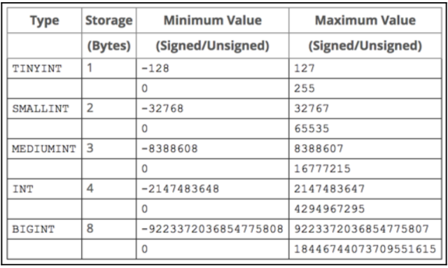

# Nguyên tắc cơ bản về chỉ mục trong MySQL

## **Nguyên tắc cơ bản**
- **Cột có kích thước nhỏ hơn sẽ tạo chỉ mục nhanh hơn.**
- **Ví dụ**:
  - Nên chọn chỉ mục cho cột kiểu **INT** hay **VARCHAR**?
  - Câu trả lời là **INT**, vì kiểu dữ liệu này chiếm ít không gian hơn so với **VARCHAR**.
- **Lợi ích**:
  - Chỉ số có kích thước nhỏ hơn sẽ giúp tăng hiệu suất chỉ mục.
  - Nếu bạn có cơ hội sử dụng dữ liệu có kích thước nhỏ nhất, hiệu suất chỉ mục sẽ tốt hơn.

---

## **Ví dụ thực tế**
1. **Chỉ mục tốt hơn trên các cột nhỏ**:
   - Tốt hơn hết là tạo chỉ mục trên cột như **zip code** (mã bưu điện) thay vì trên cả **postal code** và **country**.

2. **Không nên tạo chỉ mục trên bảng nhỏ**:
   - Chi phí bảo trì chỉ mục có thể lớn hơn lợi ích mang lại, đặc biệt đối với các bảng nhỏ.

---

## **Vai trò của kiểu dữ liệu**
Kiểu dữ liệu của cột không chỉ ảnh hưởng đến kích thước, mà còn giúp dự đoán số lượng bản ghi có thể chứa trong bảng.

### **Ví dụ 1: Kiểu dữ liệu INT**
- Nếu sử dụng kiểu dữ liệu **INT**, bảng có thể chứa tối đa **4 tỷ giá trị không dấu**.
- **Lợi ích**:
  - Lựa chọn phù hợp cho các bảng có dữ liệu lớn.

### **Ví dụ 2: Kiểu dữ liệu SMALLINT**
- Nếu bạn không dự kiến có hơn 20,000 khách hàng, sử dụng **SMALLINT** là hợp lý:
  - **SMALLINT không dấu** có thể chứa tối đa **32,767** giá trị.
  
- **Lợi ích**:
- **1. Tiết kiệm không gian lưu trữ**
- **SMALLINT** chỉ dùng **2 bytes** cho mỗi giá trị, trong khi kiểu dữ liệu lớn hơn như **INT** sẽ dùng **4 bytes** (gấp đôi).

- **Ví dụ:**
Giả sử bảng của bạn có **1 triệu dòng**:
- **Dùng SMALLINT**:
1,000,000×2 bytes=2 MB
- **Dùng INT**:
1,000,000×4 bytes=4 MB
- **Kết quả**:
  - Tiết kiệm: Tiết kiệm 2 MB bộ nhớ.

---

## **2. Hiệu suất tốt hơn**
- Dữ liệu nhỏ hơn sẽ được xử lý nhanh hơn khi thực hiện các truy vấn.
- Đặc biệt là khi:
  - **Quét toàn bộ bảng**: Ít dữ liệu hơn giúp giảm thời gian truy xuất.
  - **Sắp xếp (ORDER BY)**: Số byte nhỏ hơn giúp tăng tốc độ sắp xếp.

---

## **Kết luận**
1. **Lựa chọn loại dữ liệu nhỏ nhất có thể** cho cột được lập chỉ mục (như **INT** hoặc **SMALLINT**) sẽ cải thiện hiệu suất chỉ mục.
2. **Tránh lập chỉ mục trên các bảng nhỏ** hoặc các cột không thường xuyên được tìm kiếm.
3. **Hiệu quả của chỉ mục** không chỉ phụ thuộc vào kích thước, mà còn vào cách bạn dự đoán lượng dữ liệu sẽ phát triển trong tương lai.

# Cân nhắc khi tối ưu hóa với chỉ mục

## **Lưu ý quan trọng**
- Việc sử dụng nhiều chỉ mục có thể cải thiện hiệu suất **truy vấn đọc** (SELECT), nhưng lại ảnh hưởng đến hiệu suất của các thao tác:
  - **Cập nhật** (UPDATE)
  - **Chèn** (INSERT)
  - **Xóa** (DELETE)

## **Tác động của chỉ mục**
- Mỗi lần thực hiện thao tác **INSERT**, **UPDATE**, hoặc **DELETE**, MySQL cần cập nhật các chỉ mục tương ứng, dẫn đến:
  - **Tăng thời gian thực thi**: Do phải duy trì tính toàn vẹn của chỉ mục.
  - **Tăng chi phí tài nguyên**: CPU và I/O bị tiêu tốn nhiều hơn.

## **Chiến lược cân bằng**
- **Giữ cân bằng giữa số lượng chỉ mục và các thao tác dữ liệu khác**:
  - Tập trung chỉ mục vào các cột thực sự cần thiết cho truy vấn.
  - Tránh tạo chỉ mục không cần thiết hoặc trên các bảng nhỏ với tần suất truy vấn thấp.

## **Kết luận**
- **Chỉ mục rất quan trọng**, nhưng không nên lạm dụng.
- Một chiến lược tối ưu cần đảm bảo sự cân bằng giữa hiệu suất của các **truy vấn đọc** và các **thao tác ghi**.
