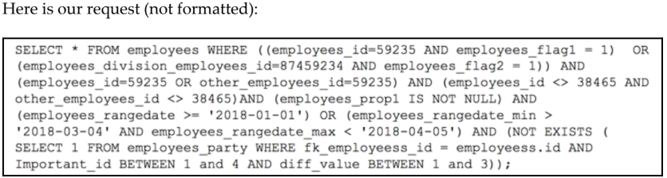
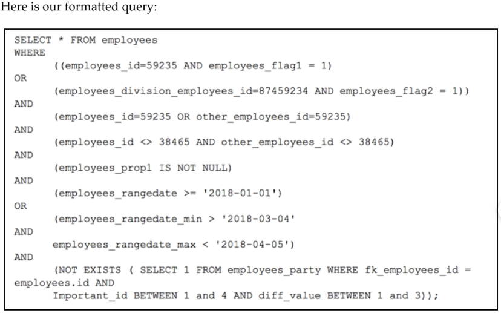
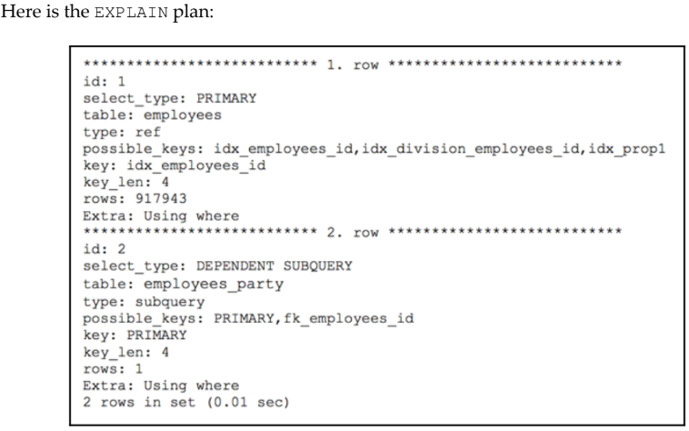
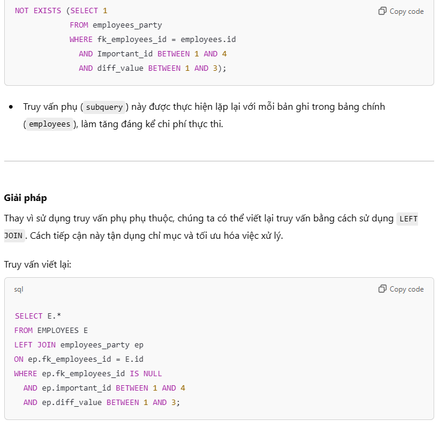

---

```sql
SELECT * FROM employees
WHERE
  ((employees_id=59235 AND employees_flag1 = 1)
  OR
  (employees_division_employees_id=87459234 AND employees_flag2 = 1))
AND
  (employees_id=59235 OR other_employees_id=59235)
AND
  (employees_id <> 38465 AND other_employees_id <> 38465)
AND
  (employees_prop1 IS NOT NULL)
AND
  (employees_rangedate >= '2018-01-01')
OR
  (employees_rangedate_min > '2018-03-04'
   AND employees_rangedate_max < '2018-04-05')
AND
  (NOT EXISTS (SELECT 1 FROM employees_party WHERE fk_employees_id =
   employees_id AND
   Important_id BETWEEN 1 AND 4 AND diff_value BETWEEN 1 AND 3));

```
---

---
### Trong kế hoạch thực thi (execution plan) của truy vấn, chúng ta thấy rằng:

#### SUBQUERY DEPENDENT: MySQL phải thực thi một truy vấn con phụ thuộc lặp lại nhiều lần. Điều này dẫn đến hiệu suất kém khi MySQL phải xử lý một lượng lớn dữ liệu.


### LEFT JOIN cho phép MySQL kết hợp dữ liệu trực tiếp giữa hai bảng và kiểm tra các điều kiện trên.

### In conclusion, our optimization required four actions:
1. Formatting the query
2. Executing an EXPLAIN plan and analysis
3. Rewriting the query
4. Creating a combined index

