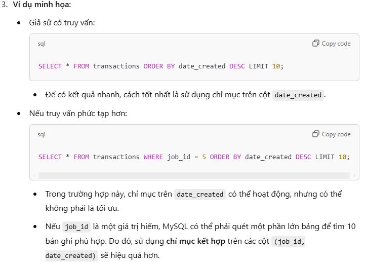
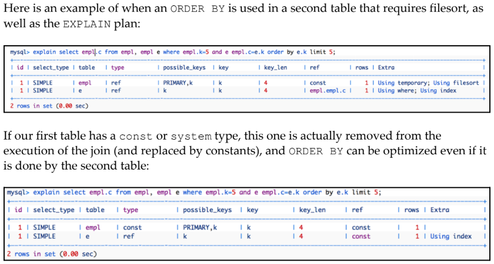

### Bạn có biết rằng các vấn đề về hiệu suất thường xuất phát từ việc sử dụng ORDER BY và LIMIT trong MySQL?

### Dưới đây là những gì bạn cần biết để tối ưu hóa ORDER BY và LIMIT nhằm tránh các vấn đề hiệu suất.

# Tầm quan trọng của ORDER BY và LIMIT trong MySQL
- ORDER BY và LIMIT là hai thành phần thường được sử dụng nhất trong các ứng dụng web và doanh nghiệp, đặc biệt khi làm việc với tập dữ liệu lớn cần sắp xếp.
- Ví dụ:
Nhiều trang web sử dụng ORDER BY để sắp xếp "top tags", "người dùng vừa đăng ký gần đây", và các tác vụ tương tự.
```sql
SELECT ... WHERE [điều kiện] ORDER BY [sắp xếp] LIMIT N1, M1
```
---

####  Nếu bảng đầu tiên của chúng ta có kiểu const hoặc system, bảng này thực tế sẽ bị loại bỏ khỏi quá trình thực thi phép JOIN (và được thay thế bằng các hằng số). Khi đó, ORDER BY vẫn có thể được tối ưu hóa ngay cả khi nó được thực hiện bởi bảng thứ hai.

#### Giải thích:
- Khi bảng đầu tiên trong JOIN là const hoặc system:
MySQL coi bảng này như một tập hợp các giá trị hằng số (constants) thay vì thực hiện truy vấn trên bảng đó.
- Điều này giúp giảm khối lượng công việc của MySQL, vì nó không phải duyệt qua toàn bộ bảng đầu tiên.
- Kết quả là, phép ORDER BY được thực thi hiệu quả hơn dù liên quan đến cột từ bảng thứ hai trong JOIN.

## Nếu ORDER BY sử dụng một cột trong bảng không phải là bảng đầu tiên trong thứ tự của phép JOIN, thì chỉ mục (index) sẽ không được sử dụng.



### Trong nghiên cứu trường hợp này, chúng ta đã học cách chuyển đổi một filesort (thao tác gây ảnh hưởng đến hiệu suất truy vấn) bằng cách sử dụng:
1. Một cột là khóa chính.
2. Một cột khác nằm trong một chỉ mục xếp hạng (ranking index).