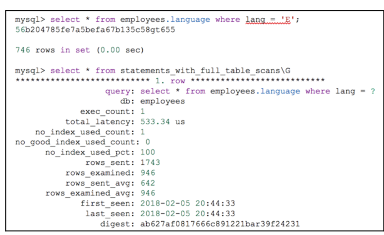
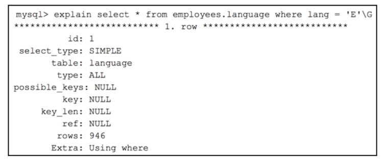

## Phần thưởng – các chỉ mục tiềm năng bị thiếu

### Các bảng tóm tắt hiệu suất trong schema có chứa một số cột thú vị. Trong trường hợp của chúng ta, hai cột quan trọng là:

- NO_INDEX_USED (cho biết các chỉ mục không được sử dụng).
- NO_GOOD_INDEX_USED (cho biết MySQL không tìm thấy chỉ mục phù hợp cho truy vấn).
- Trong SYS schema, bạn sẽ tìm thấy một view cơ sở trỏ đến bảng performance_schema.events_statements_summary_by_digest, rất hữu ích cho mục đích này thông qua câu lệnh statements_with_full_table_scans, giữ tất cả các hướng dẫn đã thực hiện phân tích bảng.

- Truy vấn trước đó không sử dụng chỉ mục vì không có chỉ mục phù hợp để MySQL sử dụng. Hãy xem kết quả của kế hoạch thực thi (execution plan) như sau:

- Trong ví dụ của chúng ta, bảng language không chứa một chỉ mục trên cột lang. Đề xuất ở đây, tất nhiên, là tạo một chỉ mục trên cột lang để làm cho truy vấn của chúng ta nhanh hơn.