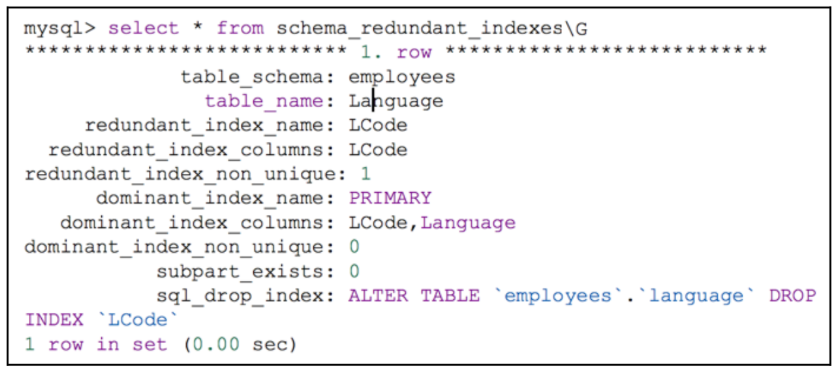

# **Duplicate Indexes (Chỉ mục trùng lặp)**

---

## **Khái niệm**
- **Duplicate Indexes** là các chỉ mục trùng lặp, có phạm vi giống nhau hoặc tương tự nhau.
- Chúng không cải thiện hiệu suất nhưng lại tăng chi phí bảo trì và làm phức tạp cấu trúc bảng.

---

## **Tìm kiếm Duplicate Indexes**
- Sử dụng view **`schema_redundant_indexes`** trong **SYS schema** để xác định các chỉ mục trùng lặp.
- View này dựa trên bảng:
```sql
-- Tìm chỉ mục trùng lặp:
SELECT * FROM sys.schema_redundant_indexes;
-- Xóa chỉ mục trùng lặp:
DROP INDEX duplicate_index_name ON table_name;
```
