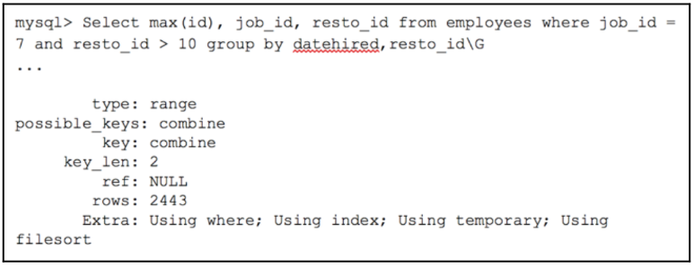

# Optimizing a query with a GROUP BY clause
### Let's look at this simple example: a question about the number of employees in each restaurant:

- When we look at the output, we can see that there is no indexes are used by MySQL (no
proper ones are available). We do, however, notice Using temporary; Using filesort.
MySQL will unfortunately have to create a temporary table to satisfy the GROUP BY clause
and also the fact that it has to support four thousand records.

### We create a combined index such as follows:
```sql
Alter table employees add index combine(job_id, resto_id, datehired);
```

