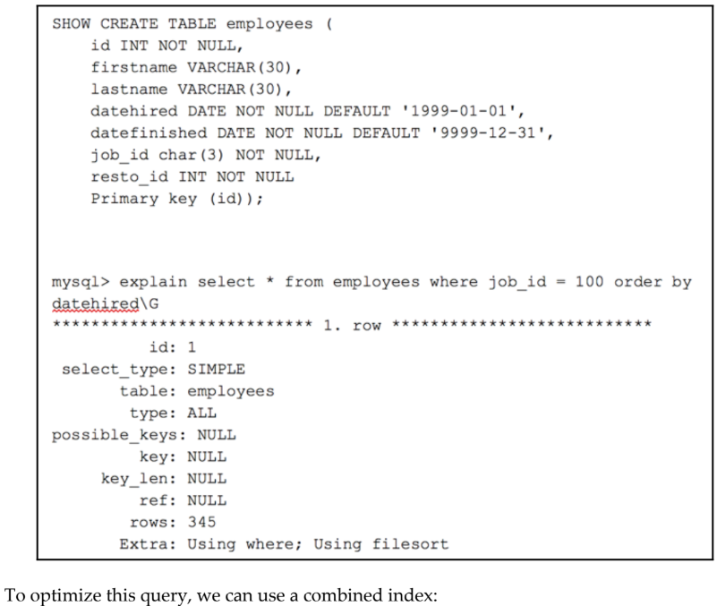
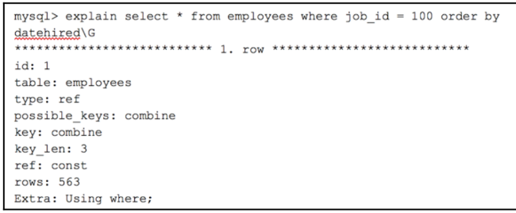

## Filesort là gì?
- Filesort là một thuật ngữ MySQL dùng để mô tả quá trình sắp xếp các bản ghi khi kết quả truy vấn không thể được sắp xếp bằng cách sử dụng chỉ mục.

```sql
To optimize this query, we can use a combined index:
Alter combine(job_id, datehired);
```

