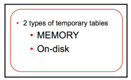
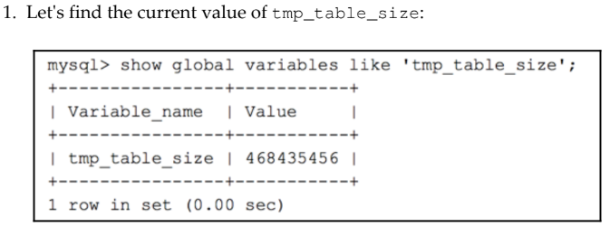
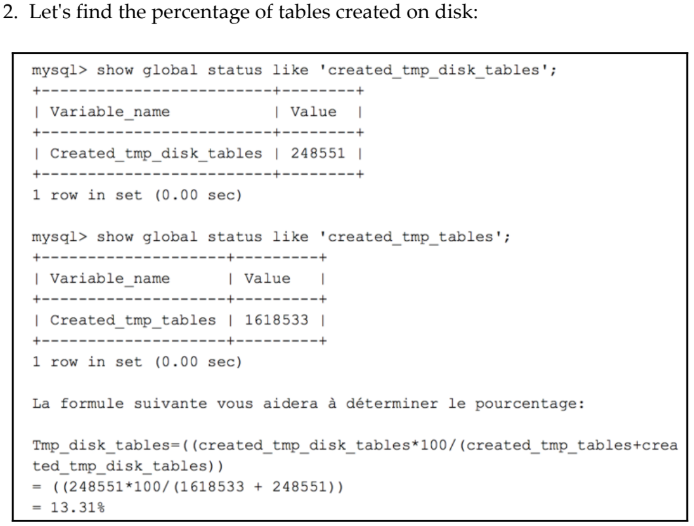

## Why does MySQL need to create temporary tables with GROUP BY, RANGE, ORDER BY, and other expressions?"

- MEMORY Temporary Tables (Bảng tạm trên bộ nhớ):
- On-Disk Temporary Tables (Bảng tạm trên đĩa)
- Nếu bảng tạm vượt quá giới hạn bộ nhớ, MySQL sẽ chuyển sang sử dụng On-Disk.

#### tmp_table_size: This determines the maximum size for temporary tables in memory
#### max_heap_table_size: This sets the maximum size for MEMORY tables


- Tỷ lệ các bảng tạm thời được tạo trên đĩa dường như hợp lý. Với tỷ lệ vượt quá 25%, việc tăng tmp_table_size là một khả năng. Nếu cần, bạn có thể thiết lập bằng lệnh sau:

```sql
set global tmp_table_size=468435456;
```
- Hãy nhớ rằng tmp_table_size và max_heap_table_size nên có cùng giá trị. Mục tiêu chính trong việc tối ưu hóa tmp_table_size của MySQL là tránh việc tạo bảng tạm thời càng nhiều càng tốt. Chỉ cần tăng giá trị của tmp_table_size và max_heap_table_size sẽ cho phép các truy vấn chậm và các bảng chưa được lập chỉ mục đúng cách phản hồi nhanh hơn.

### If the ratio of tables created on the disk is ever greater than 50%, start by checking your database indexing to ensure it is correctly set up for JOIN and GROUP BY. After adjusting the index, wait a few days and adjust the tmp_table_size if necessary.