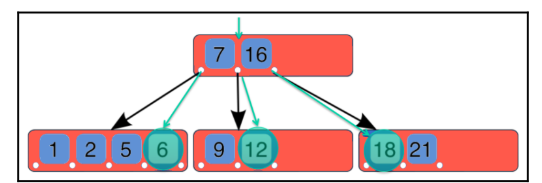

# Tối ưu hóa truy vấn với mệnh đề WHERE
Trước khi bắt đầu tìm hiểu cách tối ưu hóa truy vấn với mệnh đề WHERE, bạn cần biết công thức tối ưu hóa cần áp dụng để đạt được hiệu quả.

## Công thức tối ưu hóa:
- Xác định truy vấn chậm: Xác định truy vấn nào đang gây ra hiệu suất kém.
- Chạy lệnh EXPLAIN: Sử dụng EXPLAIN để phân tích kế hoạch thực thi của truy vấn chậm.
- Xác định loại vấn đề: Xác định loại vấn đề về hiệu suất mà truy vấn gặp phải (ví dụ: quét toàn bộ bảng - full scan).
- Chạy lệnh SHOW CREATE TABLE: Áp dụng lệnh này lên các bảng liên quan trong truy vấn chậm để kiểm tra cấu trúc bảng.
- Kiểm tra chỉ mục và thứ tự cột trong WHERE: Đảm bảo truy vấn sử dụng đúng chỉ mục và thứ tự các cột trong mệnh đề WHERE.
- Sửa đổi truy vấn nếu cần thiết: Thực hiện các thay đổi hoặc điều chỉnh cần thiết.
---
## Giới thiệu về chỉ mục B-tree
Trước khi đưa ra ví dụ từ công thức tối ưu hóa, cần giải thích cách chỉ mục hoạt động trong MySQL để hiểu rõ tác động của chỉ mục khi sử dụng mệnh đề WHERE.

- Chỉ mục B-tree là loại chỉ mục mặc định trong MySQL.
- Các thao tác được hỗ trợ bởi chỉ mục B-tree bao gồm tìm kiếm theo phạm vi - (interval) hoặc giá trị cụ thể (equality).
- Cấu trúc B-tree gồm các nút (nodes) lưu trữ con trỏ (pointers) đến các nút con, giúp tăng hiệu suất tìm kiếm trong cơ sở dữ liệu.


---

## Chỉ mục B-tree là gì?
Chỉ mục B-tree bao gồm các nút bên trong (internal nodes) có thể chứa một số biến nút con (child node variables) trong một phạm vi được xác định trước. Khi dữ liệu được chèn hoặc xóa khỏi một nút, số lượng nút con của nó sẽ tự động thay đổi.
```sql
-- Ví dụ: về mệnh đề WHERE sử dụng chỉ mục B-tree
-- Dưới đây là cách MySQL sử dụng chỉ mục để tìm kiếm một giá trị cụ thể.
SELECT * FROM employees WHERE employeeid = 12;
```
### Các bước thực thi truy vấn với chỉ mục B-tree:
- Duyệt qua cây (B-tree): Truy vấn quét qua cây và di chuyển trực tiếp đến nhánh đầu tiên có liên quan.
- Dừng tìm kiếm: Ngay khi tìm thấy giá trị duy nhất (employeeid = 12), quá trình tìm kiếm kết thúc.

---
## Khi có nhiều giá trị trong điều kiện WHERE
Giả sử bạn cần tìm nhiều giá trị cụ thể, ví dụ với truy vấn sau:
```sql
SELECT * FROM employees WHERE employeeid IN (6, 12, 18);
```
### Các bước thực thi truy vấn với chỉ mục B-tree:
### 1. Duyệt qua cây (Browse the tree):

Truy vấn bắt đầu quét qua cây B-tree và kiểm tra các nhánh liên quan.
### 2. Tìm các giá trị trên các nút (Find the values across the nodes):

Tại mỗi nhánh, MySQL tìm kiếm các giá trị 6, 12, và 18.
### 3. Dừng lại khi tìm thấy giá trị duy nhất (Stop when you know the unique values have been found):

Khi MySQL đã xác định được tất cả các giá trị cần tìm, quá trình tìm kiếm dừng lại.


---

## Hiểu rõ hơn về chỉ mục B-tree qua ví dụ với mệnh đề WHERE
Sau khi đã nắm được cách hoạt động của chỉ mục kiểu B-tree, hãy cùng xem một ví dụ thực tế với mệnh đề WHERE để hiểu thêm về cách tối ưu hóa truy vấn.

### Công thức tối ưu hóa (Optimization Recipe):
#### 1. Xác định truy vấn chậm: Tìm truy vấn có hiệu suất kém.
#### 2. Chạy lệnh EXPLAIN: Phân tích kế hoạch thực thi truy vấn.
#### 3. Xác định vấn đề: Xác định lý do truy vấn chậm (ví dụ: quét toàn bộ bảng - full scan).
#### 4. Xem cấu trúc bảng: Sử dụng lệnh SHOW CREATE TABLE để kiểm tra cấu trúc bảng liên quan.
#### 5. Kiểm tra chỉ mục: Đảm bảo truy vấn sử dụng đúng chỉ mục và thứ tự các cột trong mệnh đề WHERE.
#### 6. Sửa đổi truy vấn hoặc chỉ mục: Thực hiện các thay đổi cần thiết.

---
### Trong ví dụ trước, MySQL đã sử dụng chỉ mục hiệu quả nhất có sẵn để tối ưu hóa truy vấn.
### Bây giờ, chúng ta sẽ kiểm tra cách chỉ mục kết hợp (combined index) hoạt động với cấu trúc bảng được điều chỉnh lại.

- Dưới đây là cấu trúc bảng của chúng ta, nhưng lần này chúng ta đã thay đổi job_id:

```
key_len được tính như sau:
Key_len = tổng kích thước (tính bằng byte) của các phần chỉ mục được sử dụng.
Vì vậy, trong ví dụ trước, chúng ta sẽ có:
combine(job_id, resto_id, datehired)
```
- Cột đầu tiên của chúng ta là job_id với kiểu dữ liệu CHAR(3); lưu ý rằng key_len là 3.
- Và nếu tôi thêm một cột khác, ví dụ: resto_id, thì chúng ta có khả năng sẽ có key_len = 13 vì cột này có kiểu dữ liệu là INTEGER.

### Bây giờ, hãy để tôi trình bày một ví dụ phức tạp hơn một chút:


Như bạn có thể nhận thấy, vì chúng ta không sử dụng chính xác cột đầu tiên của chỉ mục ở phía bên trái, nên hiện tại chúng ta đã có một quét toàn bộ bảng (full scan).