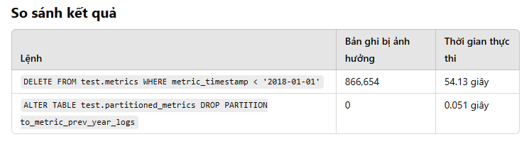

## Kết luận
### Xóa dữ liệu bằng phân vùng nhanh hơn rất nhiều so với lệnh DELETE, đặc biệt khi xử lý khối lượng dữ liệu lớn.
### Phân vùng nên được sử dụng khi:
1. Bảng có hàng triệu bản ghi.
2. Cần loại bỏ dữ liệu cũ một cách nhanh chóng.
### Tuy nhiên, chỉ nên dùng phân vùng sau khi đã tối ưu hóa truy vấn và cân nhắc các hạn chế:
1. Khóa chính và khóa duy nhất bị ảnh hưởng.
2. Khóa ngoại không được hỗ trợ (ngoại trừ MySQL 8.0).