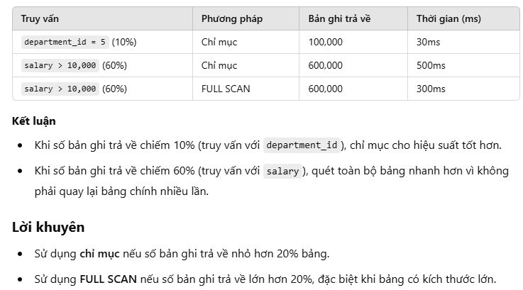

# **Các mẹo tối ưu hóa**

## Các mẹo chính để tối ưu hóa:
1. **Sử dụng Temporary và Filesort**:
   - Các thao tác này thường xuất hiện trong `JOIN`, `GROUP BY`, và `ORDER BY`.
   - Có thể loại bỏ chúng trong một số điều kiện, như đã thảo luận trước đó.

2. **Tránh ép buộc sử dụng chỉ mục**:
   - Tránh sử dụng `USE`, `FORCE`, `IGNORE`, hoặc `STRAIGHT_JOIN`.
   - Những chỉ dẫn này cho thấy chiến lược chỉ mục chưa được tối ưu hóa hoặc có quá nhiều chỉ mục trên cùng một cột.

3. **Vấn đề về CPU**:
   - Vấn đề CPU thường là do truy vấn chậm. Hãy xem xét và tối ưu hóa lại các truy vấn này.

4. **Quét toàn bộ bảng vs. Chỉ mục**:
   - Nếu hơn 20% bản ghi được truy cập, quét toàn bộ bảng (FULL SCAN) sẽ nhanh hơn so với sử dụng chỉ mục (INDEX).
   

5. **`SHOW CREATE TABLE` vs. `DESCRIBE`**:
   - Sử dụng `SHOW CREATE TABLE` để mô tả chi tiết cấu trúc bảng.
   - Nó cung cấp thông tin chi tiết hơn so với `DESCRIBE` và rất cần thiết cho quy trình tối ưu hóa.

---

# **Kỹ thuật tối ưu hóa**

## **Kỹ thuật sử dụng chỉ mục và quét toàn bộ bảng:**
1. **Khi sử dụng chỉ mục (INDEX):**
   - Nếu hầu hết các bản ghi có thể bị loại bỏ bằng cách sử dụng chỉ mục, chỉ mục sẽ là cách hiệu quả nhất để truy vấn dữ liệu.
   - Chỉ mục phù hợp khi nó giúp giảm số lượng bản ghi cần xử lý.

2. **Khi sử dụng quét toàn bộ bảng (FULL SCAN):**
   - Nếu chỉ mục không thể loại bỏ được nhiều bản ghi, hiệu suất truy vấn sử dụng chỉ mục có thể kém hơn so với việc quét toàn bộ bảng.
   - Trong trường hợp này, giải pháp đơn giản là sử dụng **FULL SCAN**.

3. **Quy tắc thực hành tốt (Good Practice):**
   - Nếu lượng dữ liệu cần truy cập vượt quá 20% tổng dữ liệu trong bảng, việc sử dụng **FULL SCAN** có thể nhanh hơn so với sử dụng chỉ mục.
   - Quy tắc "20%" này là một tiêu chuẩn thực hành tốt để quyết định giữa việc sử dụng chỉ mục hay quét toàn bộ bảng.

---
